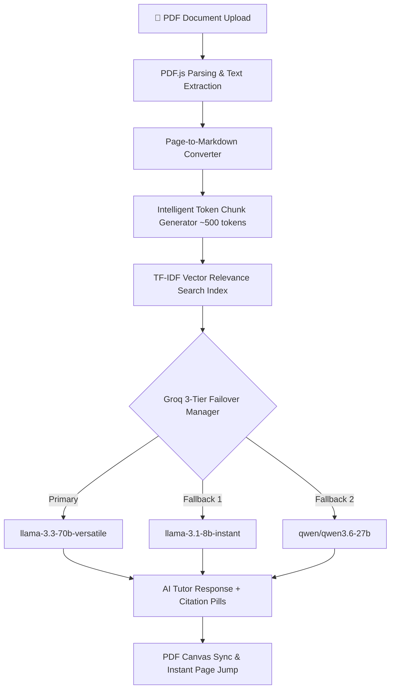

# Smart PDF Learning Assistant 🎓📄

> An AI-powered, token-efficient document learning platform featuring integrated PDF.js canvas viewer, real-time pipeline status tracking, Groq 3-tier model failover manager, smart citations, interactive study tools, and diagnostic verification suite.

---

## 🚀 Key Features & Capabilities

- 📄 **Integrated PDF.js Canvas Viewer**: Render documents natively with interactive page navigation, zoom controls, and visual highlight sync.
- 🎯 **Smart Citations & Canvas Jump**: Returns citation pills (e.g. `✓ Page 1 (Confidence: High)`). Clicking any pill automatically scrolls and updates the canvas viewer to target that exact page.
- ⚡ **Groq 3-Tier Resilient Model Failover**: Transparent model fallback manager (`llama-3.3-70b-versatile` ➔ `llama-3.1-8b-instant` ➔ `qwen/qwen3.6-27b`) handling rate limit (HTTP 429) errors without dropping user context.
- 🧠 **AI Explain Personas**: Toggle between 4 distinct learning modes:
  - **Beginner**: Simple real-world analogies.
  - **Student**: Structured concept breakdowns.
  - **Technical**: Deep-dive specs and implementation details.
  - **Exam Revision**: High-yield exam points & key facts.
- 📚 **Interactive Study Hub**:
  - **Auto-Generated Summaries**: Chapter and page-level summary generation.
  - **Keywords & Definitions**: Automatic extraction of core terminology.
  - **Categorized Exam Questions**: 2-Mark, 5-Mark, and 10-Mark question pools.
  - **Interactive Scoring Quiz**: Instant multiple-choice quizzes with live scoring and explanations.
  - **Flashcards**: Interactive study cards with flip animations.
  - **Page Notes**: Persistent per-page note-taking notebook.
- 🧪 **Diagnostic Test Suite**: Automated 4-part subsystem verification script (`tests/testPipeline.js`).
- 📊 **Dedicated PowerPoint Presentation**: Included widescreen presentation deck ([`Smart_PDF_Learning_Assistant_Presentation.pptx`](file:///c:/discordbot/internship/ai%20pdf%20viewer/Smart_PDF_Learning_Assistant_Presentation.pptx)).

---

## 🏗️ System Architecture & Data Flow



---

## ⚡ Quick Start (One-Click Launch)

Double-click [`run.bat`](file:///c:/discordbot/internship/ai%20pdf%20viewer/run.bat) in the project root folder.

This single batch script automatically starts:
1. **Backend Server Engine**: `http://localhost:5000`
2. **React Vite Frontend**: `http://localhost:3000`

---

## 🛠️ Manual Installation & Launch

### 1. Environment Configuration
Create `server/.env` with your Groq API key:
```env
PORT=5000
GROQ_API_KEY=your_groq_api_key_here
```

### 2. Backend Setup
```bash
cd server
npm install
npm run dev
```

### 3. Frontend Setup
```bash
cd client
npm install
npm run dev
```

---

## 🧪 Running Diagnostic Verification Tests

The repository includes a comprehensive subsystem test suite to verify core pipeline components:

```bash
node tests/testPipeline.js
```

### Test Suite Coverage:
- **Test 1: Markdown Converter**: Validates conversion of raw PDF text to structured Markdown headers/lists.
- **Test 2: Token Chunk Generator**: Enforces target token boundaries (~500 tokens/chunk) with page-range tracking.
- **Test 3: TF-IDF Search Engine**: Validates relevance ranking and keyword match scoring.
- **Test 4: Vision AI Graceful Safety Net**: Verifies graceful fallback when API keys or vision models are unconfigured.

---

## 📡 API Reference Specifications

| Endpoint | Method | Description | Payload / Params |
| :--- | :--- | :--- | :--- |
| `/api/health` | `GET` | System health check & timestamp | None |
| `/api/upload` | `POST` | Ingest PDF, convert to Markdown & build chunk index | `multipart/form-data` (file) |
| `/api/chat` | `POST` | Ask AI Tutor with 3-tier failover & citation pills | `{ message, explainMode, documentContext }` |
| `/api/study-tools` | `POST` | Generate summaries, quizzes, keywords, or exam questions | `{ toolType, documentContext }` |

---

## 📁 Repository Directory Structure

```text
ai pdf viewer/
├── client/                      # React Vite Frontend Application
│   ├── src/
│   │   ├── components/          # Canvas Viewer, AI Chat, Study Hub Components
│   │   └── App.jsx              # Main Application Orchestrator
│   └── package.json
├── server/                      # Node.js Express Backend Engine
│   ├── src/
│   │   ├── ai/groqManager.js    # Groq 3-Tier Model Resilient Fallback Engine
│   │   ├── parser/              # Markdown Converter & Token Chunk Generator
│   │   ├── routes/              # Express API Routes (upload, chat, study)
│   │   └── services/            # TF-IDF Search Engine Service
│   ├── server.js                # Express Server Entry Point
│   └── package.json
├── tests/
│   └── testPipeline.js          # Subsystem Diagnostic Test Suite
├── ppt_images/                  # Widescreen Presentation Image Assets
├── Smart_PDF_Learning_Assistant_Presentation.pptx  # 5-Slide Presentation Deck
├── run.bat                      # One-Click Concurrent Batch Launcher
└── README.md                    # Project Documentation
```

---

## 👨‍💻 Author & Contact

**Sujoy Kar**  
*Information Science & Engineering Student | Full-Stack AI Developer*  
- **GitHub**: [GigaVolt3](https://github.com/GigaVolt3)  
- **Projects**: MoonStomper (32,000+ LOC), Smart PDF Learning Assistant
